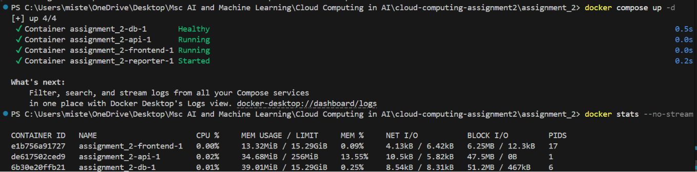

# CoinSafe Financial Dashboard

A containerised multi-tier financial dashboard built with Docker Compose: an Nginx frontend, a Flask REST API and a PostgreSQL database, with network isolation and resource limits. Built for the Cloud Computing in AI module of my MSc at Queen Mary University of London.

---

## Project structure

```
finance-dashboard-docker-postgres/
├── frontend/
│   ├── index.html
│   ├── package.json
│   └── Dockerfile
├── api/
│   ├── app.py
│   ├── requirements.txt
│   └── Dockerfile
├── reporter/
│   ├── report.py
│   ├── requirements.txt
│   └── Dockerfile
├── init.sql
├── docker-compose.yml
├── .dockerignore
└── .gitignore
```

---

## Quick start

```bash
docker compose up --build
```

Database credentials in `docker-compose.yml` are local development defaults, not for production use.

| Service | URL |
|---|---|
| Dashboard | http://localhost:80 |
| API — transactions | http://localhost:5000/api/transactions |
| API — summary | http://localhost:5000/api/summary |
| API — health | http://localhost:5000/health |

---

## Architecture

```
[Browser] → [frontend :80] → [api :5000] → [db :5432]
                                                ↑
                                           [reporter]
```

| Service | Role |
|---|---|
| **frontend** | Nginx serves the compiled dashboard. Fetches and displays transactions and summary data from the API |
| **api** | Flask REST API — the only service that can query the database |
| **db** | PostgreSQL with pre-loaded schema and seed data |
| **reporter** | Script that connects to the database, prints a daily summary, and exits |

Two custom networks enforce isolation — `public_net` connects the frontend and api, 
while `private_net` connects the api, db, and reporter. The database exists only on 
`private_net` and is completely unreachable from the frontend. The api bridges both 
networks, receiving requests from the frontend on `public_net` and querying the 
database on `private_net`.

---

## Running the reporter

The reporter runs automatically on startup. To run it manually:
```bash
docker compose run --rm reporter
```

To view the output:
```bash
docker compose logs reporter
```

To stop everything:
```bash
docker compose down
```

To stop and delete all stored data:
```bash
docker compose down -v
```

---

## Resource limits

The `api` service is capped at **256MB memory** and **0.5 CPUs** to prevent it from consuming all available host resources.

To verify:
```bash
docker compose up -d
docker stats --no-stream
```

The `api` row should show `256MiB` in the LIMIT column.



---

## Design decisions

### Why the frontend uses a multi-stage build

The multi-stage build produces a more secure final image by ensuring it contains only what is needed to serve the application at runtime. The first stage uses a Node.js image to install dependencies and run the build step, producing a compiled dist/ folder. The second stage starts fresh from nginx:alpine and copies only that output. Node.js, npm, all source files, and every installed package are discarded. Smaller images have fewer installed packages and therefore fewer known vulnerabilities. Even if the container were compromised, an attacker would find only the compiled static files with no build tools, no source code, and no installed packages to exploit.

### Why the database is isolated from the frontend

The database is isolated from the frontend because exposing a database directly to a public facing layer is a critical security risk. In a financial application, the database contains sensitive transaction data that should only be accessible through a controlled interface. Placing the database exclusively on a private network and routing all access through the api limits what is exposed and reduces the number of potential vulnerabilities. Docker enforces network separation through namespaces, ensuring containers on different networks have no IP route between them. This means any request to the database must pass through the api, where validation and logging can be applied. Even if the frontend container were compromised, the attacker would gain no direct access to the data.

### How ENTRYPOINT and CMD work together in the reporter

In the reporter Dockerfile, `ENTRYPOINT ["python"]` and `CMD ["report.py"]` work together to define how the container runs. ENTRYPOINT sets the executable that always runs, CMD provides the default argument passed to it, and Docker combines them at runtime into `python report.py`. They are deliberately separated rather than written as a single command because it makes the container more flexible — ENTRYPOINT stays fixed while CMD can be swapped out at runtime by passing a different argument. This means the container behaves like a named command with a sensible default, but can be pointed at a different script without changing the Dockerfile.